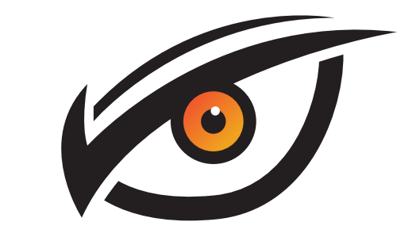
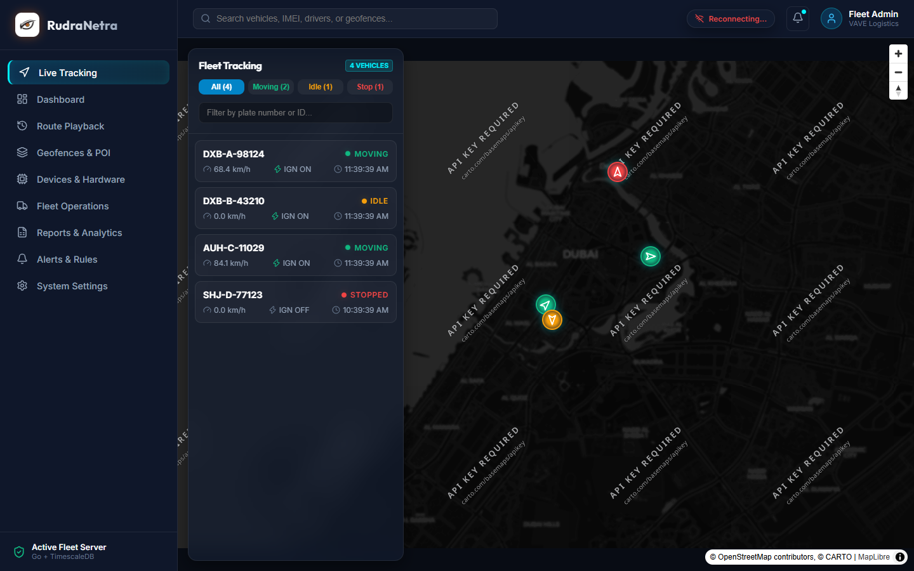
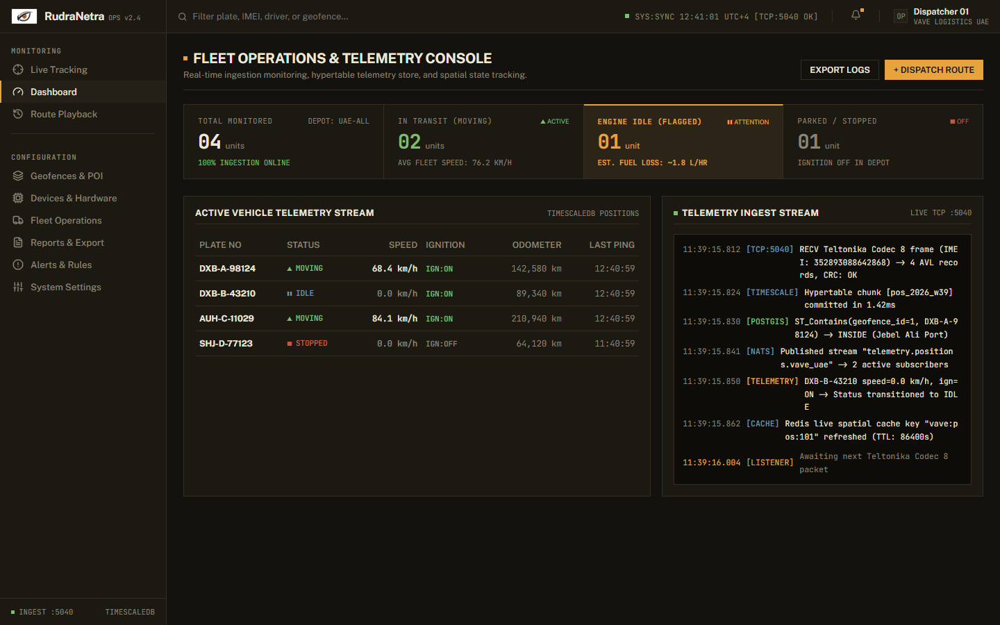
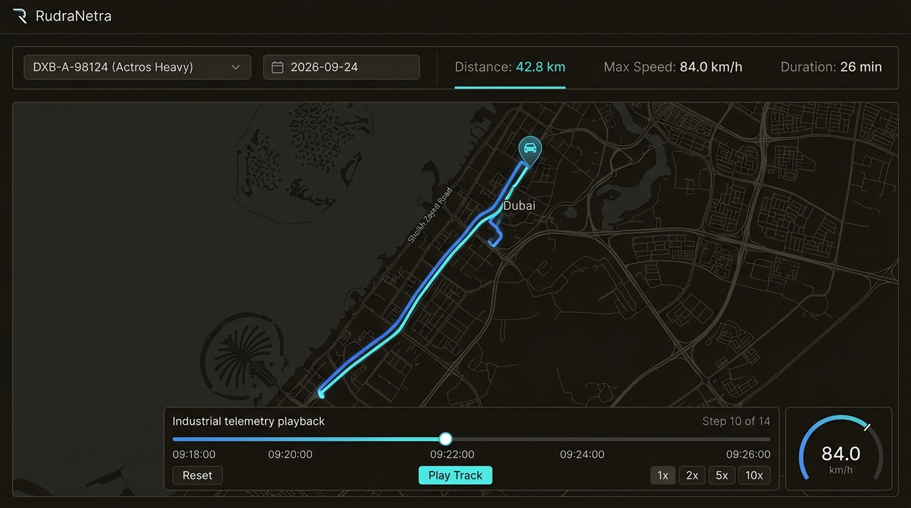
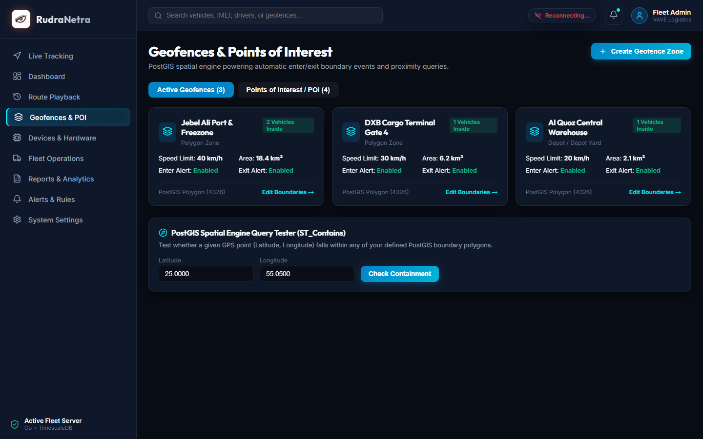
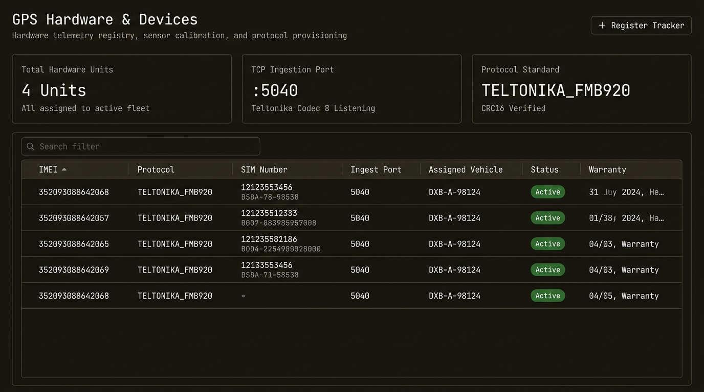
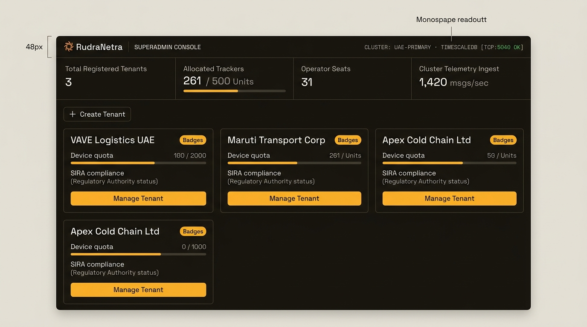
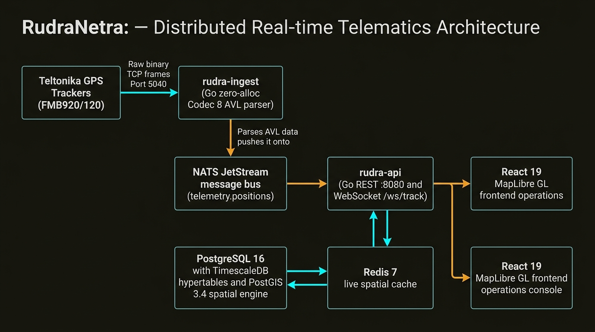

<p align="center">
  
</p>

<h1 align="center">RudraNetra</h1>

<p align="center">
  <strong>Real-Time Enterprise Telematics, GPS Ingestion Engine & Spatial Fleet Intelligence</strong>
</p>

<p align="center">
  <a href="#-overview">Overview</a> •
  <a href="#-visual-showcase">Showcase</a> •
  <a href="#%EF%B8%8F-system-architecture">Architecture</a> •
  <a href="#-core-capabilities">Capabilities</a> •
  <a href="#-tech-stack">Tech Stack</a> •
  <a href="#-quick-start">Quick Start</a> •
  <a href="#-project-layout">Layout</a>
</p>

<p align="center">
  
  
  
  
  
  
  
  
</p>

---

## 📖 Overview

**RudraNetra** is an enterprise-scale rewrite of the legacy telematics platform (`vave.uae` and `Admin.uae`). Moving away from monolithic ASP.NET WebForms and single-node MSSQL setups, RudraNetra delivers a cloud-native, event-driven distributed architecture designed to ingest hundreds of thousands of concurrent GPS telemetry pings per second with millisecond latency.

- **High-Concurrency TCP Engine**: Direct binary socket listener parsing Teltonika Codec 8 / Codec 8 Extended AVL frames.
- **Spatio-Temporal Time-Series**: TimescaleDB hypertables partitioned by time and vehicle for instant analytical queries across millions of coordinates.
- **Spatial GIS Boundary Engine**: PostGIS spatial indexing (`ST_Contains`, `ST_DWithin`, `ST_MakeLine`) for instant geofence entry/exit detection and trip segment computation.
- **Low-Latency Event Streaming**: NATS JetStream message broker powering real-time WebSocket live updates and decoupled worker execution.
- **Modern User Experience**: A reactive, dark-mode glassmorphic client application built with React 19, TypeScript, and MapLibre GL vector maps.

---

## 📸 Visual Showcase

### Live Tracking & Real-Time Fleet Map
*Sub-second position updates over WebSockets, animated heading orientation, vehicle telemetry drawer, and status clustering.*

<p align="center">
  
</p>

---

### Executive Fleet Intelligence
*Real-time operational KPI rollup: active moving vehicles, idle fuel waste estimations, stopped fleet units, and ingestion health.*

<p align="center">
  
</p>

---

### Historical Route Replay & Scrubbing
*Full route playback with 1x–10x playback speed, distance metrics, top speed profile, and timeline step scrubbing.*

<p align="center">
  
</p>

---

### PostGIS Polygon Geofences & Proximity Engine
*Spatial boundary polygon zones with automated enter/exit events, speed-limit enforcement, and live `ST_Contains` containment testing.*

<p align="center">
  
</p>

---

### Hardware Registry & Multi-Tenant SuperAdmin Console
*Teltonika AVL tracker provisioning, device quotas, SIRA compliance relays, and multi-tenant organization sharding.*

| GPS Hardware Registry & Provisioning | SuperAdmin Multi-Tenant Operations Console |
| :---: | :---: |
|  |  |

---

## 🏛️ System Architecture

<p align="center">
  
</p>

### Distributed Component Topology

1. **Ingestion Tier (`rudra-ingest` on TCP `:5040`)**:
   - Zero-allocation Go TCP server parsing Teltonika Codec 8 / Codec 8 Extended AVL binary packets.
   - Computes CRC16 validation, decodes variable-length IO elements (ignition, analog fuel, temperature, battery), and returns immediate binary record-count acknowledgements to IoT modems.

2. **Event Streaming Bus (NATS JetStream 2.10)**:
   - High-throughput message broker streaming decoded AVL records on subject `telemetry.positions`.
   - Decouples continuous device ingestion from database write amplification and alert processing.

3. **API & Real-Time Gateway (`rudra-api` on HTTP `:8080`)**:
   - High-performance Gin web service managing multi-tenant JWT authorization, REST query endpoints, and spatial queries.
   - Live WebSocket broadcast hub (`/ws/track`) delivering sub-200ms position updates directly to dispatch operators.

4. **Persistence & Spatial Storage Tier**:
   - **TimescaleDB Hypertables (PostgreSQL 16)**: Time-series hypertables partitioned into 7-day chunks with automated compression for sub-second range queries across tens of millions of coordinates.
   - **PostGIS 3.4**: Spatial indexing (`GIST`) evaluating polygon geofence containment (`ST_Contains`) and proximity triggers on every AVL ping.
   - **Redis 7 Live Cache**: Sub-millisecond in-memory cache maintaining the latest vehicle coordinate, speed, ignition, and heading vector.

5. **Operations Consoles (React 19 + TypeScript)**:
   - **Client Operations Console (`:5173`)**: Full-bleed MapLibre GL vector tracking, interactive route playback, geofence polygon testing, and automated dispatch management.
   - **SuperAdmin Console (`:3001`)**: Multi-tenant registry, hardware quota management, SIRA UAE compliance relays, and database shard routing.

---

## ⚙️ Core Capabilities

| Feature | Legacy System (`vave.uae`) | RudraNetra Architecture |
| :--- | :--- | :--- |
| **Ingestion Engine** | C# .NET Socket Single Listener | High-throughput Go TCP listener with CRC16 validation & zero-alloc frame parsing |
| **Telemetry Storage** | Single MSSQL `DeviceLogs` table | TimescaleDB Hypertables partitioned into 7-day chunks with automated compression |
| **Spatial Checks** | In-memory point bounding checks | PostGIS 3.4 Spatial Indices (`ST_Contains`, `ST_DWithin`, `GIST`) |
| **Real-time Map** | Polling HTTP AJAX every 10s | Event-driven WebSockets with sub-200ms latency |
| **Frontend Framework** | ASP.NET WebForms + Server Controls | React 19 + TypeScript + Vite monorepo with MapLibre GL vector tiles |
| **Tenancy Model** | Separate MSSQL databases switched via cookie | Row-level tenant isolation (`tenant_id`) with JWT context validation |

---

## 🛠️ Tech Stack

- **Backend**: Go 1.23, Gin Web Framework, Viper, `jackc/pgx/v5`
- **Database**: PostgreSQL 16 + PostGIS 3.4 + TimescaleDB (Hypertables)
- **Caching & Pub/Sub**: Redis 7, NATS JetStream 2.10
- **Frontend**: React 19, TypeScript, Vite, MapLibre GL, Zustand, Lucide React
- **DevOps & Containers**: Docker Compose, Nginx, Multi-stage Go & Node Dockerfiles

---

## ⚡ Quick Start

### 1. Launch Core Infrastructure
```bash
cd infra
docker compose up -d postgres redis nats
```

### 2. Apply Schema & Seed Dataset
```bash
# 1. Initialize schema, PostGIS extensions, and TimescaleDB hypertables
Get-Content backend\migrations\000001_init_schema.up.sql | docker exec -i rudra-postgres psql -U rudra -d rudra_netra

# 2. Seed initial multi-tenant accounts, vehicles, and geofence polygons
Get-Content backend\scripts\seed.sql | docker exec -i rudra-postgres psql -U rudra -d rudra_netra
```

### 3. Run Backend Services (Go)
```bash
cd backend

# Terminal 1: GPS Ingestion Engine (TCP :5040)
go run ./cmd/rudra-ingest

# Terminal 2: REST API & Real-time WebSocket Hub (HTTP :8080)
go run ./cmd/rudra-api

# Terminal 3: Background Worker (Alerts & Reports)
go run ./cmd/rudra-worker
```

### 4. Run Frontend Applications (pnpm)
```bash
cd frontend
pnpm install

# Start Client Fleet Portal (http://localhost:3000)
pnpm dev:client

# Start Admin Management Portal (http://localhost:3001)
pnpm dev:admin
```

---

## 🧪 Testing the Teltonika Codec 8 Parser

The AVL parser includes byte-accurate unit tests with real Teltonika sample hex frames:

```bash
cd backend
go test -v ./internal/codec
```

---

## 📁 Project Layout

```text
RudraNetra/
├── backend/
│   ├── cmd/
│   │   ├── rudra-api/          # REST API & WebSocket gateway
│   │   ├── rudra-ingest/       # High-throughput TCP AVL listener (:5040)
│   │   └── rudra-worker/       # Background geofence worker & scheduled reports
│   ├── internal/
│   │   ├── codec/              # Teltonika Codec 8 / 8 Extended binary parser
│   │   ├── config/             # Viper centralized configuration
│   │   ├── domain/             # Position, Vehicle, Geofence, Device models
│   │   ├── handler/            # Gin HTTP & WebSocket route controllers
│   │   ├── repository/         # TimescaleDB & PostGIS spatial repositories
│   │   ├── service/            # Tracking, Geofence evaluation, Auth services
│   │   └── websocket/          # Real-time WebSocket client connection hub
│   ├── migrations/             # Versioned SQL migrations (PostGIS + Timescale)
│   └── scripts/                # Database seed data scripts
├── frontend/
│   ├── apps/
│   │   ├── client/             # Live tracking, playback, geofence fleet app (:3000)
│   │   └── admin/              # Multi-tenant company provisioning portal (:3001)
│   └── packages/
│       └── ui/                 # Reusable UI component library (<RudraNetraLogo />)
├── infra/
│   ├── docker-compose.yml      # Orchestration for TimescaleDB, Redis, NATS, Apps
│   └── nginx/                  # Reverse proxy configuration
└── docs/
    └── assets/                 # Brand logos and high-res UI screenshots
```

---

## 📄 License
Enterprise Telematics Platform. All rights reserved.
